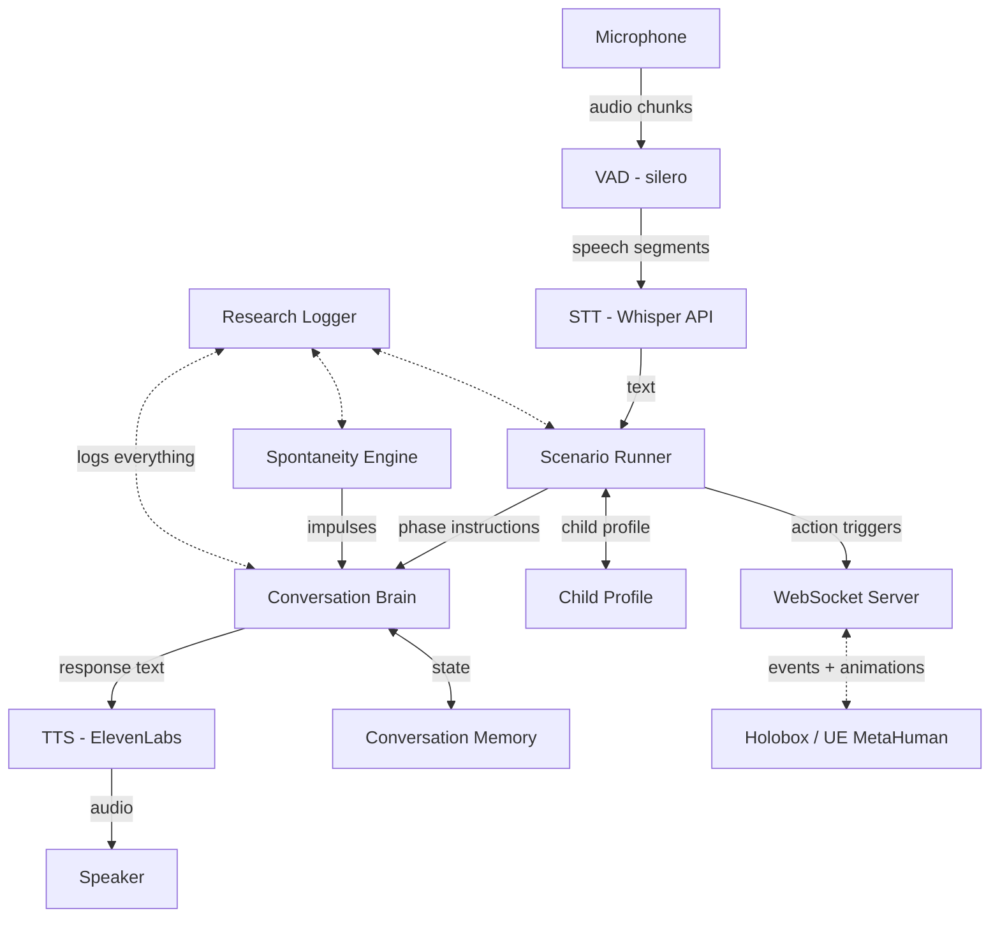

# Holobox Conversational Agent PoC

## Architecture

Two layers: a **conversation layer** (voice pipeline + spontaneity) and a **scenario layer** (structured interaction beats from Meike's research designs). The scenario runner acts as a director -- it tells the brain _what phase we're in_ and _what to accomplish_, while the brain handles _how to say it_. Spontaneity fires _within_ phases, keeping things human-messy even inside structured sequences.



## Tech Stack

- **Python 3.12+** with **asyncio** for concurrent audio + spontaneity
- **uv** for dependency management
- **sounddevice** for mic/speaker I/O
- **silero-vad** for voice activity detection (handles kid pauses without premature cutoff)
- **OpenAI Whisper API** for STT (solid Dutch support)
- **OpenAI GPT-4o** for the conversation brain (fast, multilingual, good at persona adherence)
- **ElevenLabs** for TTS (natural Dutch voices, low latency streaming)
- **WebSocket** (via websockets lib) for future Holobox integration events

## Project Structure

```
holoboxbotpoc/
  pyproject.toml
  README.md
  .env.example
  src/holobot/
    __init__.py
    main.py              # async orchestrator, ties everything together
    config.py            # pydantic settings (env vars, spontaneity params)
    audio/
      capture.py         # mic input + VAD + silence detection
      playback.py        # speaker output, handles interruption
    stt/
      base.py            # protocol/interface
      whisper.py         # OpenAI Whisper implementation
    tts/
      base.py            # protocol/interface
      elevenlabs.py      # ElevenLabs streaming TTS
    brain/
      conversation.py    # LLM interaction, message history, persona injection
      persona.py         # loads persona config, builds system prompt
      spontaneity.py     # THE key module - background impulse generator
    scenario/
      runner.py          # phase-based state machine driving interaction flow
      phase.py           # phase definitions and transition logic
      child_profile.py   # structured child data (name, age, interests)
    integration/
      websocket.py       # event server for Holobox (agent_speaking, thinking, actions)
    research/
      logger.py          # structured event logging (JSON lines)
  personas/
    default.yaml         # persona definition (name, traits, spontaneity style)
  scenarios/
    surprise_game.yaml   # Meike scenario 1: guess-the-hand + avatar reward
    avatar_interests.yaml # Meike scenario 2: interest-driven avatar generation
    memory_test.yaml     # Meike scenario 3: conversational memory assessment
    free_chat.yaml       # open-ended conversation (original mode, no phases)
  logs/                  # research output directory
```

## The Spontaneity Engine (core research component)

This is the novel part. A background async loop that monitors conversation state and fires "impulses" -- spontaneous utterances the agent generates without user input.

**Impulse types:**

- `idle_wonder` -- after silence: "Hé, weet je waar ik net aan moest denken?"
- `curious_question` -- unprompted question about the kid: "Mag ik je iets vragen?"
- `self_correction` -- revising something said earlier: "Wacht even... dat klopt eigenlijk niet"
- `topic_tangent` -- going off on a related tangent
- `thinking_aloud` -- visible processing: "Hmm, laat me even nadenken..."
- `playful_tease` -- kid-appropriate humor or challenge

**Configurable parameters** (for research A/B testing):

- `spontaneity_level`: 0 (off/control), 1 (idle-only), 2 (moderate), 3 (frequent/messy)
- `min_silence_before_impulse`: seconds of silence before idle impulses fire (default: 8s)
- `impulse_probability`: chance per check cycle (default: 0.3)
- `enabled_impulse_types`: which types are active
- `max_impulses_per_minute`: rate limiter to prevent overwhelming kids

**How it works:** The engine gets a read-only view of conversation state (last utterance, silence duration, topic, turn count, kid engagement signals). Every N seconds it evaluates whether to fire. If it fires, it sends a prompt to the LLM with the impulse type as instruction, and the result gets injected into the TTS pipeline.

## Persona System

YAML-based persona config. The persona defines who the agent "is" and how it behaves. Loaded at startup, injected as system prompt.

```yaml
name: "Bibi"
presentation: "a curious kid who lives in the library"
age_vibe: "about 10"
language: "nl"
personality:
  - curious and easily excited
  - slightly chaotic, sometimes loses train of thought
  - loves stories and books
  - asks weird questions
  - occasionally forgetful (on purpose)
voice_id: "..." # ElevenLabs voice ID
spontaneity_style: "scattered but warm"
```

## Conversation Flow and Turn-Taking

Kids are not adults. The agent must handle:

- **Long pauses** (kid is thinking, not done) -- VAD + configurable silence threshold before agent assumes turn
- **Short utterances** -- "ja", "nee", "weet ik niet" need graceful follow-up
- **Interruptions** -- if kid speaks while agent talks, agent stops (audio playback cancel)
- **Wandering off** -- silence > threshold triggers spontaneity engine, not awkward waiting

## Scenario System (Meike's interaction designs)

A scenario is a YAML-defined sequence of **phases**, each with a goal, LLM instructions, expected data to collect, and optional Holobox action triggers. The scenario runner is a lightweight state machine that sits between user input and the conversation brain.

**How it works:** Each phase injects context into the LLM system prompt ("you are now in the greeting phase, your goal is to learn the child's name"). The brain still generates natural conversation, but guided toward the phase goal. When the goal is met (e.g., child said their name), the runner transitions to the next phase. Spontaneity fires _within_ phases -- the agent can still go off on tangents while working toward the goal.

**Phase structure:**

```yaml
phases:
  - id: greeting
    goal: "Learn the child's name"
    instruction: "Begroet het kind en vraag hoe het heet. Wees enthousiast."
    extract: [child_name]
    max_turns: 5
    on_complete:
      action: null
      next: guessing_game

  - id: guessing_game
    goal: "Play a guessing game — which hand holds the surprise"
    instruction: "Zeg dat je een verrassing hebt. Vraag het kind: in welke hand? Links of rechts?"
    extract: [child_guess]
    max_turns: 4
    on_complete:
      action: reveal_surprise # Holobox animation trigger
      next: avatar_reveal

  - id: avatar_reveal
    goal: "Show the personalized avatar and say goodbye"
    instruction: "Laat het kind weten dat er een speciaal kaartje voor hen is gemaakt."
    extract: []
    max_turns: 3
    on_complete:
      action: show_avatar_card
      next: farewell
```

**Scenario 1 -- Surprise Game:** greeting -> guessing_game -> avatar_reveal -> farewell
**Scenario 2 -- Interest Avatar:** greeting -> collect_interests -> avatar_creation -> avatar_reveal -> farewell
**Scenario 3 -- Memory Test:** greeting -> conversation_with_plants -> memory_test -> farewell

### Child Profile

Structured data extracted during conversation, tracked per session:

- `child_name` -- extracted from natural conversation ("Ik heet Emma")
- `child_age` -- if shared
- `child_interests` -- hobbies, favorite books, activities
- `child_guess` -- for the guessing game

Extraction uses the LLM with a structured output call (JSON mode) after each user turn during relevant phases. This data feeds both the avatar generation system and the research logger.

### Memory Plants (Scenario 3)

The VH deliberately introduces memorable information during conversation:

- States its own name clearly at start
- Performs a notable action (e.g., "pen out of pocket" -- sent as Holobox animation trigger)
- Later tests recall: "Weet je nog hoe ik heet?" or "Wat haalde ik net uit mijn zak?"

Memory plants are defined in the scenario YAML with `plant_at` (phase) and `test_at` (phase) fields.

## Integration Layer (for Holobox later)

WebSocket server emitting two types of events:

**State events** (continuous):

- `agent_listening` -- agent is waiting for input
- `agent_thinking` -- LLM is generating
- `agent_speaking` -- TTS is playing (with text for lip sync)
- `agent_spontaneous` -- spontaneous impulse fired (distinct animation trigger)
- `user_speaking` -- VAD detected speech
- `user_silent` -- silence detected

**Action triggers** (scenario-driven, for specific UE MetaHuman animations):

- `present_hands` -- VH shows closed fists (guessing game)
- `reveal_surprise` -- VH opens hand to show surprise
- `take_pen` -- VH takes pen from pocket (memory plant)
- `put_pen_back` -- VH puts pen back (memory plant)
- `show_avatar_card` -- VH presents the generated avatar card
- `wave_goodbye` -- farewell animation

Action triggers carry a `scenario_id` and `phase_id` so the Holobox knows which animation set to use.

This keeps the agent fully functional standalone (terminal/mic mode) while being Holobox-ready.

## Research Logging

Every event gets logged as structured JSON lines:

```json
{"ts": "...", "event": "user_utterance", "text": "...", "duration_ms": 1200}
{"ts": "...", "event": "agent_response", "text": "...", "triggered_by": "user", "latency_ms": 450}
{"ts": "...", "event": "spontaneous_impulse", "type": "idle_wonder", "text": "...", "silence_before_s": 12.3, "level": 2}
{"ts": "...", "event": "phase_transition", "scenario": "surprise_game", "from": "greeting", "to": "guessing_game"}
{"ts": "...", "event": "child_data_extracted", "field": "child_name", "value": "Emma", "phase": "greeting"}
{"ts": "...", "event": "memory_plant", "info": "vh_name", "planted_at": "greeting"}
{"ts": "...", "event": "memory_test", "info": "vh_name", "recalled": true, "phase": "memory_test"}
{"ts": "...", "event": "action_trigger", "action": "reveal_surprise", "scenario": "surprise_game", "phase": "guessing_game"}
```

This gives Pieter, Maaike, and the broader research team clean data to analyze:

- What spontaneity level does to interaction patterns (original research question)
- Whether kids retain information from the VH (memory/attention)
- How scenario structure affects engagement vs. free conversation
- Whether visual embodiment or conversational quality drives engagement

## Implementation Order

Build bottom-up, each step produces a runnable checkpoint:

### Phase 1 -- Conversation Foundation (DONE)

1. **Scaffold** -- pyproject.toml, project structure, config system
2. **Audio I/O** -- mic capture + speaker playback with sounddevice
3. **STT pipeline** -- VAD + Whisper API (can test: speak and see transcription)
4. **TTS pipeline** -- ElevenLabs streaming (can test: type text, hear it spoken)
5. **Conversation brain** -- LLM with persona, conversation memory (can test: text chat in terminal)
6. **Wire it up** -- full voice loop: speak -> transcribe -> think -> speak back
7. **Spontaneity engine** -- background impulse system with configurable levels
8. **Research logger** -- structured event logging
9. **WebSocket integration layer** -- event server for future Holobox hookup
10. **Polish** -- interruption handling, turn-taking tuning, error recovery

### Phase 2 -- Scenario Layer (Meike alignment)

11. **Scenario engine** -- phase-based state machine with YAML-driven scenario definitions
12. **Child profile** -- structured data extraction (name, age, interests) using LLM JSON mode
13. **Scenario definitions** -- YAML files for Meike's 3 scenarios + free_chat fallback
14. **Action triggers** -- extend WebSocket events with Holobox animation cues
15. **Wire scenarios into main** -- `--scenario` CLI flag, scenario selection, phase transitions
