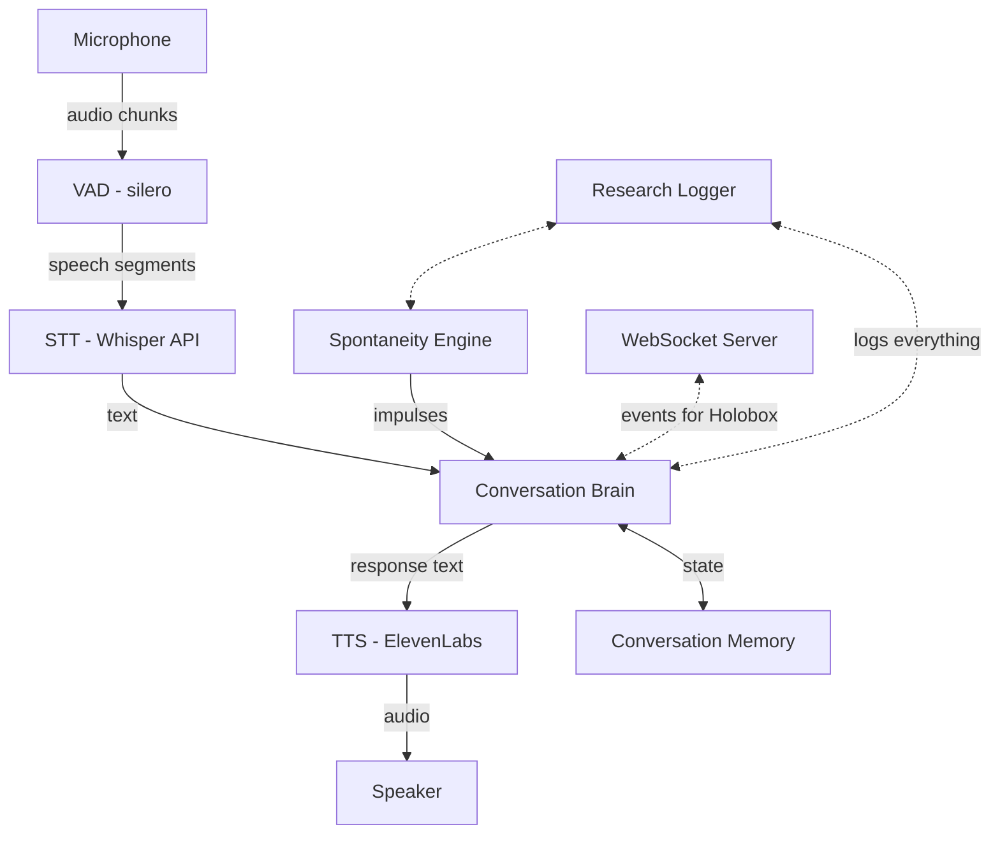

# Holobox Conversational Agent PoC

## Architecture

Modular async pipeline. Each stage is a swappable component, connected via an asyncio event bus. The spontaneity engine runs as a background task that can inject utterances into the output pipeline without user input.



## Tech Stack

- **Python 3.12+** with **asyncio** for concurrent audio + spontaneity
- **uv** for dependency management
- **sounddevice** for mic/speaker I/O
- **silero-vad** for voice activity detection (handles kid pauses without premature cutoff)
- **OpenAI Whisper API** for STT (solid Dutch support)
- **OpenAI GPT-4o** for the conversation brain (fast, multilingual, good at persona adherence)
- **ElevenLabs** for TTS (natural Dutch voices, low latency streaming)
- **WebSocket** (via websockets lib) for future Holobox integration events

## Project Structure

```
holoboxbotpoc/
  pyproject.toml
  README.md
  .env.example
  src/holobot/
    __init__.py
    main.py              # async orchestrator, ties everything together
    config.py            # pydantic settings (env vars, spontaneity params)
    audio/
      capture.py         # mic input + VAD + silence detection
      playback.py        # speaker output, handles interruption
    stt/
      base.py            # protocol/interface
      whisper.py         # OpenAI Whisper implementation
    tts/
      base.py            # protocol/interface
      elevenlabs.py      # ElevenLabs streaming TTS
    brain/
      conversation.py    # LLM interaction, message history, persona injection
      persona.py         # loads persona config, builds system prompt
      spontaneity.py     # THE key module - background impulse generator
    integration/
      websocket.py       # event server for Holobox (agent_speaking, thinking, etc.)
    research/
      logger.py          # structured event logging (JSON lines)
  personas/
    default.yaml         # persona definition (name, traits, spontaneity style)
  logs/                  # research output directory
```

## The Spontaneity Engine (core research component)

This is the novel part. A background async loop that monitors conversation state and fires "impulses" -- spontaneous utterances the agent generates without user input.

**Impulse types:**

- `idle_wonder` -- after silence: "Hé, weet je waar ik net aan moest denken?"
- `curious_question` -- unprompted question about the kid: "Mag ik je iets vragen?"
- `self_correction` -- revising something said earlier: "Wacht even... dat klopt eigenlijk niet"
- `topic_tangent` -- going off on a related tangent
- `thinking_aloud` -- visible processing: "Hmm, laat me even nadenken..."
- `playful_tease` -- kid-appropriate humor or challenge

**Configurable parameters** (for research A/B testing):

- `spontaneity_level`: 0 (off/control), 1 (idle-only), 2 (moderate), 3 (frequent/messy)
- `min_silence_before_impulse`: seconds of silence before idle impulses fire (default: 8s)
- `impulse_probability`: chance per check cycle (default: 0.3)
- `enabled_impulse_types`: which types are active
- `max_impulses_per_minute`: rate limiter to prevent overwhelming kids

**How it works:** The engine gets a read-only view of conversation state (last utterance, silence duration, topic, turn count, kid engagement signals). Every N seconds it evaluates whether to fire. If it fires, it sends a prompt to the LLM with the impulse type as instruction, and the result gets injected into the TTS pipeline.

## Persona System

YAML-based persona config. The persona defines who the agent "is" and how it behaves. Loaded at startup, injected as system prompt.

```yaml
name: "Bibi"
presentation: "a curious kid who lives in the library"
age_vibe: "about 10"
language: "nl"
personality:
  - curious and easily excited
  - slightly chaotic, sometimes loses train of thought
  - loves stories and books
  - asks weird questions
  - occasionally forgetful (on purpose)
voice_id: "..." # ElevenLabs voice ID
spontaneity_style: "scattered but warm"
```

## Conversation Flow and Turn-Taking

Kids are not adults. The agent must handle:

- **Long pauses** (kid is thinking, not done) -- VAD + configurable silence threshold before agent assumes turn
- **Short utterances** -- "ja", "nee", "weet ik niet" need graceful follow-up
- **Interruptions** -- if kid speaks while agent talks, agent stops (audio playback cancel)
- **Wandering off** -- silence > threshold triggers spontaneity engine, not awkward waiting

## Integration Layer (for Holobox later)

WebSocket server emitting events that the Unreal Engine MetaHuman can consume:

- `agent_listening` -- agent is waiting for input
- `agent_thinking` -- LLM is generating
- `agent_speaking` -- TTS is playing (with text for lip sync)
- `agent_spontaneous` -- spontaneous impulse fired (distinct animation trigger)
- `user_speaking` -- VAD detected speech
- `user_silent` -- silence detected

This keeps the agent fully functional standalone (terminal/mic mode) while being Holobox-ready.

## Research Logging

Every event gets logged as structured JSON lines:

```json
{"ts": "...", "event": "user_utterance", "text": "...", "duration_ms": 1200}
{"ts": "...", "event": "agent_response", "text": "...", "triggered_by": "user", "latency_ms": 450}
{"ts": "...", "event": "spontaneous_impulse", "type": "idle_wonder", "text": "...", "silence_before_s": 12.3, "level": 2}
```

This gives Pieter and Maaike clean data to analyze what spontaneity does to interaction patterns.

## Implementation Order

Build bottom-up, each step produces a runnable checkpoint:

1. **Scaffold** -- pyproject.toml, project structure, config system
2. **Audio I/O** -- mic capture + speaker playback with sounddevice
3. **STT pipeline** -- VAD + Whisper API (can test: speak and see transcription)
4. **TTS pipeline** -- ElevenLabs streaming (can test: type text, hear it spoken)
5. **Conversation brain** -- LLM with persona, conversation memory (can test: text chat in terminal)
6. **Wire it up** -- full voice loop: speak -> transcribe -> think -> speak back
7. **Spontaneity engine** -- background impulse system with configurable levels
8. **Research logger** -- structured event logging
9. **WebSocket integration layer** -- event server for future Holobox hookup
10. **Polish** -- interruption handling, turn-taking tuning, error recovery
